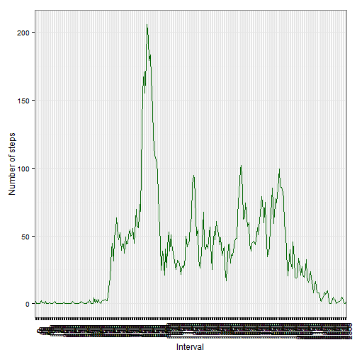

#### PA1_template
author: "Iga Korneta"

date: "Thursday, August 07, 2014"

#####1. Loading and preprocessing the data


```r
act <- read.csv("./activity.csv")
act$interval <- as.factor(act$interval)
```

#####2. What is mean total number of steps taken per day?


```r
library(ggplot2)

temp <- data.frame (tapply(act$steps, act$date, sum))
colnames(temp) <- "step_sum"
p1 <- ggplot(temp, aes(x=step_sum)) + geom_bar(fill="orange", binwidth=500)+theme_bw()+xlab("Steps")+ylab("Frequency")
step.mean <- mean(temp[,1], na.rm=TRUE)
step.median <- median(temp[,1], na.rm=TRUE)
p1
```

 

The mean total number of steps taken per day is 

```
## [1] 10766
```


The median total number of steps taken per day is 

```
## [1] 10765
```


#####3. What is the average daily activity pattern?


```r
library(plyr)

temp <- act[!is.na(act$steps),]
temp2 <- adply(tapply(temp$steps, temp$interval, mean), c(1))
colnames(temp2) <- c("interval", "steps")

p2 <- ggplot(temp2, aes(x=interval, y=steps, group=1)) + geom_line(color="dark green")
p2 <- p2 + theme_bw()+xlab("Interval")+ylab("Number of steps")+theme(axis.text.x=element_text(angle=90))
temp2.max <- temp2[which(temp2[,2]==max(temp2[,2])),1]

p2
```

 

The interval with the maximum number of steps taken is 

```
## [1] 835
## 288 Levels: 0 5 10 15 20 25 30 35 40 45 50 55 100 105 110 115 120 ... 2355
```

The corresponding number of steps is

```
## [1] 206.2
```


#####4. Imputing missing values


```r
number.nas <- sum(is.na(act$steps))
act.nas.filled <- act
for (i in 1:nrow(act)){
  if (is.na(act[i,1])) 
    {act.nas.filled[i,1] <- temp2[which(temp2$interval==act[i,3]), 2]}
  }

temp <- data.frame (tapply(act.nas.filled$steps, act.nas.filled$date, sum))
colnames(temp) <- "step_sum"
p3 <- ggplot(temp, aes(x=step_sum)) + geom_bar(fill="orange", binwidth=500)+theme_bw()+xlab("Steps")+ylab("Frequency")
step.new.mean <- mean(temp[,1], na.rm=TRUE)
step.new.median <- median(temp[,1], na.rm=TRUE)

p3                  
```

 

The new mean total number of steps taken per day is 

```
## [1] 10766
```


The new median total number of steps taken per day is 

```
## [1] 10766
```

It's larger by 1, as you can see!

#####5. Are there differences in activity patterns between weekdays and weekends?

```r
act.nas.filled$date <- as.Date(act.nas.filled$date, format="%Y-%m-%d")
act.nas.filled$weekday <- weekdays(act.nas.filled$date)
act.nas.filled$weekday <- ifelse(act.nas.filled$weekday %in% c("Saturday", "Sunday"), "weekend", "weekday")
act.nas.filled$weekday <- as.factor(act.nas.filled$weekday)

temp <- adply(tapply(act.nas.filled$steps, act.nas.filled[, c(3,4)], mean), c(1,2))
colnames(temp) <- c("interval", "weekday", "steps")

p5 <- ggplot(temp, aes(x=interval, y=steps, group=1)) + geom_line(color="dark green")
p5 <- p5 + theme_bw()+xlab("Interval")+ylab("Number of steps")+theme(axis.text.x=element_text(angle=90))
p5 <- p5 + facet_wrap(~weekday, nrow=2)
p5
```

 
